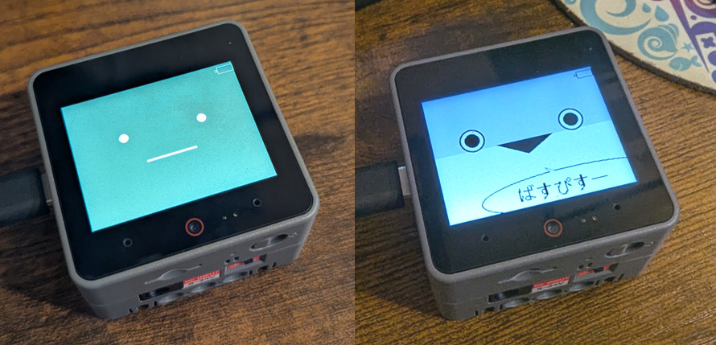

# my-stack-chan-DIY-Base

@mongonta0716さんが公開されている
[stack-chan-tester](https://github.com/mongonta0716/stack-chan-tester)
をベースにした、Avaterプログラムでよく使うコードを簡単にまとめたサンプルプログラムです。

主に、M5Stack-Avatarの顔を出しつつM5StackのUnitモジュールを動かしたい場合のプログラムのひな型利用を想定して作りました。

下図はCoreS3ですが、初期設定では `M5Stack Core2` をビルドターゲットとしています。

BaseやCoreシリーズ以外のatomなどを使用する場合、ボタンの有無や種類が異なる場合があります。ご注意ください。

## サンプル実装している内容

- 主要なM5Stack製品用のplatformio.ini
- CoreS3を使用する場合のための追加設定
- M5Stack-Avatarの初期設定
- ログ設定
- スピーカーのボリューム設定
- 顔のサイズやポジション変更
- 顔の色変更（規定のカラーコード、オリジナルのRGB設定）
- バッテリーアイコンの表示／非表示
- フォントの指定
- CoreS3でのボタン有効化設定
  - 画面=タッチパネルを [右] [中央] [左] に3等分した領域がそれぞれBtnA, BtnB, BtnCに対応
- ボタンA,B,Cの仮実装
- ボタンA
  - スピーカーを鳴らす
  - M5Stack-Avatarの表情変更
  - M5Stack-Avatarの台詞表示
- ボタンB
  - M5Stack-Avatarの台詞をテキスト変数で渡して表示
  - 変数をログに出力
- ボタンC
  - M5Stack-Avatarの顔変更
    - おまけとして、カスタムアバターを1つ実装しています。

## このサンプルで実装しなかった内容

コードをシンプルにするため、以下の実装は[stack-chan-tester](https://github.com/mongonta0716/stack-chan-tester)の該当コードを参考に実装してください。

- サーボモーターの設定・挙動
- SDカードの読み取り
